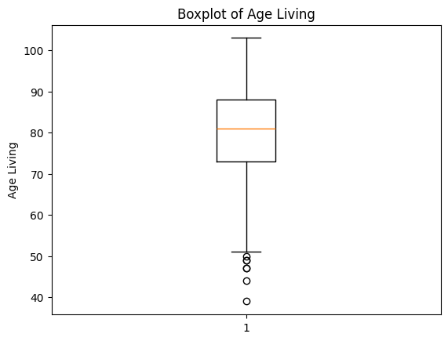

# NOBLE PRIZE WINNERS
# 📘 Project Overview
This dataset encompasses detailed information about Nobel Prize laureates from 1901 to 2016, including personal, professional, and award-related data. It serves as a valuable resource for analyzing trends, demographics, and patterns in Nobel Prize awards across various categories and time periods.
## 📊 Dataset Columns
The dataset contains the following columns:
- `year`: Year of the Nobel Prize award.  
- `category`: Category of the award (e.g., Physics, Chemistry, Medicine, Literature, Peace, Economic Sciences).  
- `prize`: Name of the prize awarded.  
- `motivation`: Reason for awarding the prize.  
- `prize_share`: Share of the prize received by the laureate(s).  
- `laureate_id`: Unique identifier for the laureate.  
- `laureate_type`: Type of laureate (Individual or Organization).  
- `full_name`: Full name of the laureate.  
- `birth_date`: Date of birth.  
- `birth_city`: City of birth.  
- `birth_country`: Country of birth.  
- `sex`: Gender of the laureate.  
- `organization_name`: Affiliated organization.  
- `organization_city`: City of the affiliated organization.  
- `organization_country`: Country of the affiliated organization.  
- `death_date`: Date of death.  
- `death_city`: City of death.  
- `death_country`: Country of death . 

# 📊 Data Visualizations and Insights
1. Age living
- The majority of laureates receive the prize between ages 50 and 70.
- Outliers are present, showing some laureates received the award at unusually young or old ages.
- Category-wise comparison using multiple boxplots can reveal which fields tend to award younger or older laureates.

# 🛠️ Tech Stack
- Python: Programming language for data manipulation and analysis.
- Pandas: Data manipulation and analysis.
- Matplotlib: Plotting and visualization.
- Seaborn: Statistical data visualization.
- Numpy: Numerical computing.
